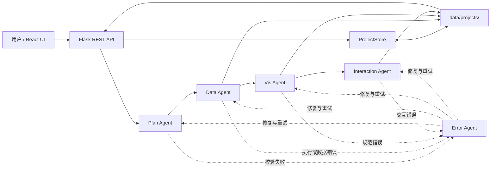

# CMV Agent

CMV Agent 是一个面向数据分析与可视化编排的前后端多 Agent 原型系统。用户创建项目、上传 CSV 或 SQLite 数据并描述分析目标后，系统会依次生成分析计划、数据处理代码、Vega-Lite 图表和跨图表交互，同时记录字段流、执行轨迹、校验结果与错误恢复过程。

> 当前项目属于开发阶段原型。后端会直接执行大模型生成的 Python 代码，请只在可信数据和隔离的开发环境中运行，不要直接作为公网服务部署。

## 主要能力

- 项目管理：创建、查看、编辑和删除独立分析项目。
- 数据接入：上传 `.csv`、`.db`、`.sqlite`、`.sqlite3` 文件，单文件最大 100 MB。
- Schema 提取：识别表、字段、类型、行数、空值与字段值域等元数据。
- 目标与计划生成：将自然语言目标细化为需求，并生成 `d → D → V → I` 依赖图。
- 数据加工：为每个 `D` 节点生成 pandas 代码，执行后保存为 CSV。
- 可视化生成：为每个 `V` 节点生成并校验 Vega-Lite 规范。
- 交互生成：为 `I` 节点生成选择、联动过滤或高亮所需的规范与 JavaScript。
- 错误恢复：分析计划、数据、可视化和交互阶段的错误；数据错误支持最多两轮基于新执行证据的修复与重新校验。
- 可观测性：展示 Agent 流程、节点详情、字段流、生成代码、错误记录和时序轨迹。

## 节点约定

| 类型 | 含义 | 输入 | 主要产物 |
| --- | --- | --- | --- |
| `d` | 原始数据表 | 上传的 CSV/SQLite 表 | 数据表 Schema 与源文件 |
| `D` | 数据处理节点 | 一个或多个 `d`/`D` 节点 | pandas 代码、`D*.csv` |
| `V` | 可视化节点 | `d`/`D` 生成的数据 | Vega-Lite JSON |
| `I` | 交互节点 | 一个或多个 `V` 节点 | I-spec、JavaScript、更新后的视图规范 |

## 系统架构



### Agent 职责

| Agent | 实现 | 职责 |
| --- | --- | --- |
| Plan Agent | `backend/agents/plan_agent.py` | 细化需求、生成节点和依赖、校验 DAG；强制所有非 `d` 节点拥有有效前继，计划校验失败时最多进行 5 轮修复。 |
| Data Agent | `backend/agents/data_agent.py` | 生成 pandas 代码、语法检查、执行、校验 DataFrame，并输出 CSV。 |
| Vis Agent | `backend/agents/vis_agent.py` | 生成 Vega-Lite spec，补齐数据 URL 和布局配置，校验 mark 与字段。 |
| Interaction Agent | `backend/agents/interaction_agent.py` | 根据 V 节点编码字段生成 I-spec、修改视图规范并生成交互 JavaScript。 |
| Error Agent | `backend/agents/error_agent.py` | 分析各阶段错误、生成修复方案、保存原始错误与结构化诊断；Data 阶段会结合 traceback、字段类型、空值统计和样例行进行纠错。 |
| Planner Agent | `backend/agents/planner_agent.py` | 综合计划边、生成的 pandas 代码、处理结果和嵌套 Vega-Lite 规范，计算直接及传递祖先字段。 |

## 处理流程

1. 创建项目并填写初始分析目标。
2. 上传 CSV 或 SQLite 文件；后端保存原文件并提取 Schema 到 `database.json`。
3. 可选地让模型根据 Schema 改写项目目标。
4. Plan Agent 生成细化需求、`d/D/V/I` 节点及依赖关系。
5. Data Agent 按依赖处理 `D` 节点，把 `result_df` 保存到 `data_tables/`。
6. Vis Agent 为 `V` 节点生成、转换并验证 Vega-Lite 规范。
7. Interaction Agent 为 `I` 节点生成联动规则与 JavaScript。
8. Planner Agent 汇总实际字段流；前端渲染依赖图、图表预览、Agent Trace 和节点详情。
9. 任一生成阶段失败时，Error Agent 保存上下文并尝试诊断、修复和重新校验；Data 阶段第一次修复若暴露出新的运行或验证错误，会携带新证据再尝试一次。

## 技术栈

### 后端

- Python、Flask、Flask-CORS
- OpenAI Python SDK，用于调用兼容 OpenAI Chat Completions 的通义千问接口
- pandas，用于执行生成的数据处理代码和读取 CSV
- Python 标准库 `sqlite3`，用于解析 SQLite 数据库

### 前端

- React 18、React Router 6
- Vite 5
- D3 7
- Vega、Vega-Lite、vega-embed

## 项目结构

```text
CMV_Agent/
├── backend/
│   ├── app.py                       # Flask 服务与 REST API
│   ├── agent.py                     # 顶层 Agent 编排及会话状态
│   ├── model.py                     # OpenAI 兼容模型客户端
│   ├── project.py                   # 项目索引和文件持久化
│   ├── database_parser.py           # CSV/SQLite 解析与 Schema 提取
│   ├── trace_manager.py             # trace.json 追加与格式化
│   ├── agents/
│   │   ├── plan_agent.py
│   │   ├── data_agent.py
│   │   ├── vis_agent.py
│   │   ├── interaction_agent.py
│   │   ├── error_agent.py
│   │   └── planner_agent.py
│   ├── prompts/                     # 各 Agent 的提示词模板
│   ├── tests/                       # Error Agent / Data 恢复回归测试
│   ├── .env.example
│   └── requirements.txt
├── frontend/
│   ├── src/
│   │   ├── api.js                   # 后端 API 封装
│   │   ├── App.jsx                  # 路由入口
│   │   ├── viewRegistry.js          # Vega View 运行时注册表
│   │   ├── interfaces/              # 项目列表与项目详情页面
│   │   └── components/              # DAG、图表、Agent 流程及详情组件
│   ├── package.json
│   └── vite.config.js
├── data/
│   └── projects/                    # 项目索引、上传数据与生成产物
└── README.md
```

## 本地运行

### 前置条件

- Python 3.9 或更高版本（建议使用虚拟环境）
- Node.js 18 或更高版本
- npm
- 可用的通义千问 API Key，或其他与当前模型列表兼容的 OpenAI 风格服务

以下示例使用 Windows Command Prompt。

### 1. 配置并启动后端

```bat
cd backend
python -m venv .venv
.venv\Scripts\activate.bat
pip install -r requirements.txt
pip install pandas
copy .env.example .env
```

编辑 `backend/.env`：

```dotenv
OPENAI_API_KEY=your_api_key_here
OPENAI_API_BASE=https://dashscope.aliyuncs.com/compatible-mode/v1
DEFAULT_MODEL=qwen-turbo
FLASK_DEBUG=true
PORT=5000
DATA_SERVICE_URL=http://localhost:5000/data
```

然后启动服务：

```bat
python app.py
```

健康检查地址为 `http://localhost:5000/api/health`。

> `pandas` 是 Data Agent 和 Vis Agent 的实际运行依赖，但当前尚未写入 `backend/requirements.txt`，因此上面的额外安装步骤不可省略。

### 2. 安装并启动前端

另开一个 Command Prompt：

```bat
cd frontend
npm ci
npm run dev
```

浏览器打开 `http://localhost:3000`。开发服务器会把 `/api` 请求代理到 `http://localhost:5000`。

### 3. 基本使用顺序

1. 在首页创建项目。
2. 进入项目后上传一个或多个数据文件。
3. 填写或自动生成项目目标。
4. 生成 Plan，并检查节点与依赖图。
5. 按节点或批量执行数据处理。
6. 生成可视化，再生成交互。
7. 在节点详情中查看表结构、Python 代码、Vega-Lite 代码、I-spec、字段流和错误信息。

## 环境变量

| 变量 | 是否必需 | 当前默认值 | 说明 |
| --- | --- | --- | --- |
| `OPENAI_API_KEY` | 是 | 无安全默认值 | 模型服务 API Key。不要提交到 Git。 |
| `OPENAI_API_BASE` | 否 | `https://dashscope.aliyuncs.com/compatible-mode/v1` | OpenAI 兼容接口根地址。 |
| `DEFAULT_MODEL` | 否 | `qwen-turbo` | 启动时使用的模型。当前支持 `qwen-turbo`、`qwen-plus`、`qwen-max`。 |
| `FLASK_DEBUG` | 否 | `false` | 设置为 `true` 时开启 Flask Debug。 |
| `PORT` | 否 | `5000` | Flask 监听端口；修改后还要同步修改 Vite 代理和 `DATA_SERVICE_URL`。 |
| `DATA_SERVICE_URL` | 否 | `http://localhost:5000/data` | Vega-Lite `data.url` 前缀；修改 Flask 端口时需同步调整。 |

端口必须保持一致：

```text
backend PORT = 5000
frontend proxy target = http://localhost:5000
DATA_SERVICE_URL = http://localhost:5000/data
```

## 数据与产物

所有项目默认保存在仓库根目录的 `data/projects/`。`ProjectStore` 使用 UUID 作为项目目录名，并通过 `projects.json` 保存索引。

```text
data/projects/
├── projects.json
└── <project_id>/
    ├── database.json                # 上传数据的 Schema 和元信息
    ├── databases/                   # 上传的原始 CSV/SQLite 文件
    ├── plan.json                    # 目标、细化需求、节点与依赖
    ├── data_tables/                 # D 节点生成的 CSV
    ├── data_result.json             # 数据、可视化及交互阶段的汇总结果
    ├── vis_result.json              # 可视化处理结果
    ├── vis_outputs/                 # 单个 V 节点规范
    ├── interactions/                # 单个 I 节点规范和 JavaScript
    ├── data_flow.json               # 节点输入/输出字段映射
    ├── trace.json                   # 生成时序与重试信息
    └── errors/                      # 原始错误、诊断、修复尝试与最终恢复状态
```

仓库中的 `data/projects/` 已包含示例/开发数据。重新生成计划或调用重置接口会删除部分生成产物；操作前请备份需要保留的结果。

## REST API

接口通常返回：

```json
{
  "success": true,
  "data": {}
}
```

失败时通常返回 `success: false`、`error` 和相应 HTTP 状态码。

### 会话与模型

| 方法 | 路径 | 说明 |
| --- | --- | --- |
| `GET` | `/api/health` | 服务健康检查 |
| `GET` | `/api/models` | 获取支持的模型列表 |
| `POST` | `/api/model/set` | 设置全局当前模型，Body：`{"model":"qwen-plus"}` |
| `POST` | `/api/chat` | 普通对话，Body：`message`、可选 `temperature` |
| `POST` | `/api/chat/stream` | SSE 流式对话 |
| `GET` | `/api/conversation/history` | 获取当前进程中的会话历史 |
| `POST` | `/api/conversation/clear` | 清空会话历史 |
| `POST` | `/api/reset` | 重置 Agent，可传 `system_prompt` |

### 项目与数据源

| 方法 | 路径 | 说明 |
| --- | --- | --- |
| `GET` / `POST` | `/api/projects` | 获取项目列表 / 创建项目 |
| `GET` / `PUT` / `DELETE` | `/api/projects/<project_id>` | 获取、更新或删除项目 |
| `GET` / `POST` | `/api/projects/<project_id>/databases` | 获取数据源列表 / 上传数据文件 |
| `DELETE` | `/api/projects/<project_id>/databases/<db_name>` | 从项目元数据中删除数据源 |

### 计划、数据、可视化与交互

| 方法 | 路径 | 说明 |
| --- | --- | --- |
| `GET` / `POST` | `/api/projects/<project_id>/plan` | 获取 / 生成计划；生成时可传 `context` |
| `POST` | `/api/projects/<project_id>/plan/generate-goal` | 根据数据库 Schema 生成项目目标 |
| `POST` | `/api/projects/<project_id>/data/process` | 批量执行 D 节点 |
| `POST` | `/api/projects/<project_id>/data/process/node/<node_id>` | 执行单个 D 节点 |
| `GET` | `/api/projects/<project_id>/data/process/result` | 获取 `data_result.json` |
| `GET` | `/api/projects/<project_id>/data/<node_id>?limit=50` | 预览节点数据和字段信息 |
| `GET` | `/api/projects/<project_id>/data/<node_id>/code` | 获取 D 节点生成的 Python 代码 |
| `GET` | `/api/projects/<project_id>/data/<filename>/download` | 下载 CSV |
| `GET` | `/data/<project_id>/<filename>` | Vega-Lite 使用的简化数据地址 |
| `POST` | `/api/projects/<project_id>/vis/process` | 批量生成 V 节点 |
| `POST` | `/api/projects/<project_id>/vis/process/node/<node_id>` | 生成单个 V 节点 |
| `GET` | `/api/projects/<project_id>/vis/<node_id>` | 获取单个 Vega-Lite 结果 |
| `POST` | `/api/projects/<project_id>/interactions/process` | 批量生成 I 节点 |
| `GET` | `/api/projects/<project_id>/interactions/<node_id>` | 获取单个交互结果 |

### 追踪与维护

| 方法 | 路径 | 说明 |
| --- | --- | --- |
| `GET` | `/api/projects/<project_id>/agents/trace` | 聚合 Plan/Data/Vis/Interaction/Error Agent 状态 |
| `GET` | `/api/projects/<project_id>/planner/data-flow` | 重新计算并返回节点字段流 |
| `GET` | `/api/projects/<project_id>/trace` | 获取底层 `trace.json` 时序记录 |
| `POST` | `/api/projects/<project_id>/reset-processing` | 清理处理产物，保留项目和上传数据 |

## 关键数据结构

### Plan

`plan.json` 的核心结构如下。注意节点键区分大小写，`d` 和 `D` 是不同类型。

```json
{
  "goal": "分析目标",
  "refined_requirements": [
    {"id": "R1", "name": "需求名称", "description": "需求描述"}
  ],
  "nodes": {
    "d": [{"id": "d1", "name": "输入表"}],
    "D": [{"id": "D1", "name": "数据处理", "task": "处理任务"}],
    "V": [{"id": "V1", "name": "图表", "chart_type": "bar"}],
    "I": [{"id": "I1", "name": "交互"}]
  },
  "dependencies": [
    {"from": "d1", "to": "D1", "type": "data"},
    {"from": "D1", "to": "V1", "type": "data"}
  ],
  "validation_errors": []
}
```

依赖图必须满足以下硬约束：

- 只有小写 `d` 输入节点可以没有前继。
- 每个 `D` 必须至少有一个 `d->D` 或 `D->D` 前继，并至少被一个 `D` 或 `V` 使用。
- 每个 `V` 必须恰好有一个 `d->V` 或 `D->V` 数据前继；`I->V` 控制边不能代替数据前继。
- 每个 `I` 必须有 `V->I` 触发前继和 `I->V` 控制目标，且触发与目标不能是同一个 V。
- 边端点必须存在，`type` 必须与端点类型一致；禁止重复边、自环、指向 `d` 的入边和任何环。

Plan Agent 在模型输出后会逐节点执行上述检查；失败时，Error Agent 会基于具体规则和节点重新生成依赖，最多修复 5 轮。

### Data Flow 字段追踪

`data_flow.json` 采用边驱动算法。对于每条 `A -> B` 依赖，系统先计算“后继 B 实际从前继 A 消费的字段集合”，记为 `edge.fields`，然后严格按边聚合：

- `A.out_fields` 加入这条出边的 `edge.fields`；
- `B.in_fields` 加入带来源限定的字段，如 `A.field_i`；
- 节点自身能够产生但没有被任何后继使用的字段，不计入 `out_fields`；
- 祖先字段另存于 `transitive_in_fields`/`ancestor_fields`，不会混入直接 `in_fields`。

不同边类型的字段证据如下：

| 边类型 | `edge.fields` 的计算方式 |
| --- | --- |
| `d->D` / `D->D` | 优先合并代码首行 `# INPUT_FIELDS: {{...}}` 声明与 pandas AST 数据帧溯源；再回退到代码字符串、节点任务或整表读取。多输入 merge 会分别分析每个输入边。 |
| `d->V` / `D->V` | 合并 `metadata.input_fields_by_table` 与递归解析 Vega-Lite encoding、layer、facet、transform 得到的实际输入字段，并与前继输出列核对。 |
| `V->I` | 使用对应 `source_views[].link_field`；缺失时才使用源/目标视图共享字段。 |
| `I->V` | 使用对应 `controlled_view[].field`；缺失时才使用交互源字段与目标视图字段的交集。 |

所有来自 Schema、处理结果、Vega-Lite 和 I-spec 的字段值都会先递归扁平化并过滤为字符串，兼容字段名意外以列表或嵌套结构返回的情况，避免 `unhashable type: 'list'`。

每个节点包含：

- `in_fields` / `direct_in_fields`：所有入边字段，使用 `<source>.<field>` 限定；
- `out_fields`：所有出边字段的并集，仅表示被后继实际消费的字段；
- `predecessors` / `ancestors`：直接前继和传递祖先节点；
- `predecessor_fields`：按直接前继分组的入边字段；
- `incoming_edges` / `outgoing_edges`：每条边的端点、类型、字段和解析证据；
- `transitive_in_fields` / `ancestor_fields`：单独保存的传递字段血缘；
- `undeclared_predecessors`：代码实际读取、但 Plan 依赖中漏写的前继节点。

`_save_data_flow` 会合并 `data_result.json` 与 `vis_result.json`，并在需要时从 `interactions/<I-id>.json` 补载 I-spec，避免单节点生成、批量可视化或交互阶段的字段信息丢失。

### Data Agent 输出约定

生成的代码第一行应为 `# INPUT_FIELDS: {{"<node_id>": ["field_i"]}}`，声明每个输入节点实际被使用的字段；该注释不影响代码执行。代码还必须创建名为 `result_df` 的 pandas `DataFrame`。后端会进行语法检查，并检查空结果、`NaN`、无穷值等问题，然后以 UTF-8 BOM CSV 写入 `data_tables/<node_id>.csv`。

每个 D 节点成功生成输出表后，Data Agent 还会单独调用模型更新字段语义目录。模型会同时读取节点任务、生成代码、新表字段与样例，以及原始表和此前所有 D 表的字段语义，并为新表的每个真实字段生成：

- `concept`：跨实体统一的规范语义，例如 `argentina_formation` 和 `brazil_formation` 都归一为 `formation`；
- `entity_scope`：与规范语义分离的球队、地区或其他实体范围；
- `semantic_type`、`unit`、`description` 和 `source_fields`：字段类型、单位、解释及语义来源。

语义结果保存在 `data_result.json` 的 `field_semantics` 中，并在后续 D 节点完成后逐表累积。模型不可用、返回无法解析或漏掉字段时，系统仍会为每个实际输出字段生成保守的名称归一化语义，避免语义目录与真实表结构脱节。

### Data 错误诊断与恢复

Data 节点出现语法、运行或结果验证错误时，Error Agent 会：

1. 保留原始错误、完整 traceback、语法检查及验证问题。
2. 读取上游 CSV 的精确字段、dtype、样例空值统计和少量样例行。
3. 先生成本地规则诊断，再让模型结合运行证据细化根因与修改建议。
4. 校验修复代码的 Python 语法和强制 `result_df` 输出契约。
5. 重新执行修复代码；若出现新的错误或 `NaN`/`Inf`/空结果，携带新证据进行第二轮修复。
6. 无论最终是否恢复，都在 `errors/data_generate_<node_id>_<timestamp>.json` 中一起保存：
   - `original_error`：原始错误、traceback 和验证问题；
   - `diagnosis`：根因、证据、解释、建议及诊断来源；
   - `fix`：最终修复代码、元数据、语法检查和模型响应；
   - `recovery_attempts`：每轮输入代码、诊断、修复及执行结果；
   - `recovery_status`：尝试次数、最终成功状态和是否已恢复。

模型诊断失败或输出无法解析时，本地规则诊断仍会继续驱动修复，并在错误记录中标明 `diagnosis_source: local_fallback`。

### Interaction Spec

I-spec 由模型根据 I 节点需求、各图表 encoding 和上述字段语义目录生成，主要包含两部分：

- `source_views[]`：交互来源视图、选择类型、来源通道、单个 `link_field` 和规范 `semantic`；该字段定义 `V->I` 边。
- `controlled_view[]`：被控制视图、单个目标 `field`、过滤/高亮动作和规范 `semantic`；该字段定义 `I->V` 边。

模型生成后，Interaction Agent 会检查 Plan 声明的所有源图和目标图均被覆盖；`link_field`、目标 `field` 和 `source_channels` 必须真实存在于对应图表 encoding；源字段与目标字段的 `concept` 和 `semantic_type` 必须兼容。物理字段名可以不同，只要规范语义相同；例如源图的 `argentina_formation` 可以控制目标图的 `brazil_formation`。无语义目录时则保守要求源目标字段同名。模型输出结构无效或调用失败时，系统会按各视图共享的规范语义进行确定性回退。

通过校验的 I-spec 会被转换为三类运行时产物：源图根据 `source_channels` 增加 Vega-Lite selection parameter，并在 `encoding.opacity` 中加入选择条件；目标图只改写一次，使用按视图命名的稳定背景/前景数据集；JavaScript 通过前端 `viewRegistry` 读取 selection signal 并更新目标图。前端的数据桥加载完成后会先用完整数据初始化前景数据集，因此目标图在用户尚未选择时也能正常显示。JavaScript 以 `semantic` 作为联动键、以各图自己的物理字段取值，因此支持同语义不同字段名的跨图过滤或高亮；point selection 同时兼容数组和嵌套 signal 结构。未通过字段和语义校验的模型 I-spec 会先回退到确定性规范，并且绝不会修改原始图表 spec。

## 开发注意事项

### 安全

- Data Agent 使用 Python `exec()` 执行模型生成的代码，并开放完整 `__builtins__`；当前没有进程、文件系统、网络或资源隔离。
- 后端启用了宽松 CORS，Debug 模式也不应在生产环境开启。
- 上传文件虽有扩展名和大小限制，但不应视为完整的恶意文件防护。
- 不要在源码中保存 API Key。若历史代码或提交中出现过真实密钥，应立即在服务商控制台撤销并轮换。

### 当前限制

- 当前自动化测试覆盖 Data 错误恢复、字段语义归一、Plan 依赖校验、多级字段流及 I-spec 到运行时交互产物的后端转换，尚缺完整 API、前端和浏览器端到端测试。
- Agent 和会话客户端以进程级全局单例保存，不适合多租户或多 Worker 隔离场景。
- `requirements.txt` 暂缺 pandas。
- 项目数据直接写入本地 JSON/CSV，缺少事务、并发写保护和数据库迁移机制。
- 删除、重置和重新生成计划会修改本地项目产物，当前没有撤销功能。

## 验证命令

后端启动后：

```bat
curl http://localhost:5000/api/health
```

前端静态构建：

```bat
cd frontend
npm run build
```

后端基础语法检查：

```bat
python -m compileall backend
```

Error Agent / Data 恢复回归测试：

```bat
python -m unittest discover -s backend/tests -v
```

## 文档维护约定

修改以下内容时，应同步更新本 README：

- 新增、删除或更名 REST API。
- 调整环境变量、端口、模型或安装依赖。
- 改变 Agent 职责、节点类型、处理顺序或错误恢复策略。
- 改变 `data/projects/` 的目录或 JSON 结构。
- 改变前端入口、页面、主要交互或构建命令。
- 引入新的安全边界、部署方式、测试命令或已知限制。

文档中的命令应以当前代码和配置为准，并至少通过语法检查、前端构建或对应的最小运行验证。
